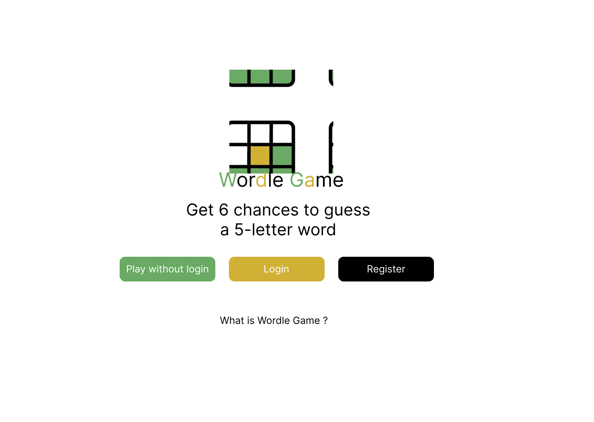

## Wordle Game

This game is written with sQT/QML and C++

Default Word is <bold>"HELLO" </bold> in the game, so Everytime you try to find "HELLO" word

## Wordle Game Interfaces

<h3> Below UI's are designed with Figma</h3>

<h5> Main Page without Login</h5>

<h5> Main Page wit Login</h5>

<h5>Register</h5>

<h5>Login</h5>

<h5>Play Game 1</h5>

<h5>Play Game 2</h5>

<h5>Play Game 3</h5>

